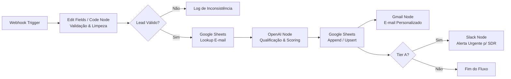

# 🎯 Desafio Criativo: Planejando Automações com N8N Usando Apenas Bons Prompts

Projeto desenvolvido como parte do **Bootcamp Santander / DIO**, demonstrando como planejar, estruturar e especificar workflows complexos no **n8n** utilizando engenharia de prompts avançada.

---

## 📋 Sumário do Desafio

- [Passo 1: Definição da Automação](#-passo-1-definição-da-automação)
- [Passo 2: Contexto, Ferramentas e Regras](#-passo-2-contexto-ferramentas-e-regras)
- [Passo 3: Prompt Final Estruturado](#-passo-3-prompt-final-estruturado)
- [Arquitetura dos Nós no N8N](#-arquitetura-dos-nós-no-n8n)
- [Como Submeter na DIO](#-como-submeter-na-dio)

---

## 🧱 Passo 1: Definição da Automação

| Campo | Descrição |
| :--- | :--- |
| **Processo** | Captura, qualificação e enriquecimento automático de novos leads com notificação multicanal. |
| **Público/Responsável** | Equipe Comercial (SDRs) e Gestão de Marketing. |
| **Resultado Esperado** | Registrar o lead no CRM (ou Google Sheets), validar o e-mail, atribuir pontuação (Lead Scoring) e notificar o canal de vendas no Slack/Discord e WhatsApp em tempo real. |

---

## 🧱 Passo 2: Contexto, Ferramentas e Regras

### 🛠️ Ferramentas Envolvidas
- **Webhook / Google Forms / Typeform** (Gatilho de entrada)
- **Google Sheets / Notion / HubSpot** (Persistência e CRM)
- **OpenAI / Claude API** (Enriquecimento e classificação do perfil do lead)
- **Gmail / SendGrid** (Envio de confirmação ao lead)
- **Slack / Discord** (Notificação imediata para a equipe de vendas)

### 🔄 Fluxo Desejado
1. **Trigger (Webhook):** Receber payload com os dados submetidos pelo formulário.
2. **Validação & Limpeza:** Verificar integridade do e-mail e formato do número de telefone.
3. **Decisão / Roteamento (IF/Switch):** Separar leads corporativos (B2B) de leads genéricos.
4. **Enriquecimento com IA (Node OpenAI):** Gerar um resumo do interesse do cliente e sugerir melhor abordagem de venda.
5. **Persistência:** Inserir ou atualizar a linha na planilha do Google Sheets.
6. **Notificação Multicanal:**
   - Disparar e-mail de boas-vindas com material de apoio ao lead.
   - Enviar alerta com tag `@vendas` no canal do Slack/Discord com os dados enriquecidos.

### ⚠️ Regras Importantes
- **Validação de Dados:** Rejeitar ou mover para fila de inconsistências payloads sem e-mail ou telefone preenchidos.
- **Tratamento de Erros:** Nó de *Error Trigger* dedicado para alertar administradores via Slack caso alguma API externa falhe.
- **Prevenção de Duplicidade:** Checar se o e-mail já existe na base antes de criar novo registro (Upsert).

---

## 🧱 Passo 3: Prompt Final Estruturado

Copie o prompt abaixo para solicitar a geração completa do workflow a qualquer IA generativa especializada em N8N:

```text
Atue como um Arquiteto e Engenheiro de Automação Especialista em N8N.

Crie uma automação completa de captura, qualificação e enriquecimento de leads para otimizar o tempo de resposta da equipe comercial.

Público:
Equipe de Vendas (SDRs), Marketing e Operações Comerciais.

Ferramentas envolvidas:
1. Webhook (Trigger HTTP POST)
2. Data Transformation (Nós Code/Set/Edit Fields)
3. Google Sheets (Armazenamento de Base)
4. OpenAI (Análise de Perfil e Lead Scoring)
5. Gmail / SendGrid (Comunicação Externa)
6. Slack / Discord (Notificação Interna)
7. Error Trigger (Resiliência e Observabilidade)

Fluxo:
1. Receber requisição HTTP POST contendo os dados do lead (nome, e-mail, cargo, empresa, faturamento estimado).
2. Validar formato do e-mail e normalizar o número de telefone (E.164).
3. Consultar no Google Sheets se o e-mail já foi cadastrado para evitar duplicidade.
4. Executar prompt via nó OpenAI para classificar o lead entre Tier A (Alta Prioridade), Tier B (Média) ou Tier C (Nutrição) com justificativa.
5. Salvar/atualizar os dados consolidados e a classificação no Google Sheets.
6. Enviar e-mail de confirmação personalizado para o lead com base no Tier.
7. Se Tier A: Enviar notificação de urgência no Slack com botão de ação rápida para o SDR.

Regras e Restrições:
- Ignorar ou registrar em log de auditoria leads com e-mail corporativo inválido.
- Implementar tratamento de fallback caso a cota da OpenAI ou a API do Slack apresente instabilidade (Error Trigger).
- Manter o schema JSON limpo e legível em cada transição de nós.

Explique quais nós nativos do N8N devem ser utilizados, suas configurações essenciais (parâmetros/credenciais) e forneça a estrutura lógica em JSON do workflow pronta para importação no N8N.
```

---

## 🧩 Arquitetura dos Nós no N8N



---

## ☁️ Como Submeter na DIO

1. **Submissão via GitHub (Recomendado):**
   - Suba esta pasta para um repositório público no seu GitHub (ex: `https://github.com/SRE-ARCHITECT/n8n-prompt-automation`).
   - Copie a URL pública do arquivo `README.md` e cole no campo **"Insira seu link aqui"** na plataforma da DIO.

2. **Submissão via Google Drive:**
   - Salve o conteúdo do prompt ou este arquivo `.md` no Google Drive.
   - Configure o compartilhamento para *"Qualquer pessoa com o link"*.
   - Cole o link compartilhado no campo de entrega da DIO.
